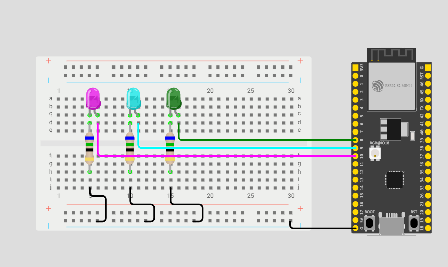

# 💡 Controle de LEDs RGB com ESP32

## 📖 Descrição

Este projeto foi desenvolvido utilizando um ESP32 para controlar três LEDs de cores diferentes. O objetivo é demonstrar o funcionamento das portas GPIO do microcontrolador, permitindo o acionamento individual dos LEDs por meio de programação.

O projeto é ideal para iniciantes que desejam aprender os conceitos básicos de eletrônica e sistemas embarcados utilizando a plataforma ESP32.

---

## 🚀 Funcionalidades

- Acionamento individual dos LEDs.
- Controle das saídas digitais do ESP32.
- Aprendizado sobre GPIOs.
- Simulação de circuitos eletrônicos.
- Aplicação de resistores para proteção dos componentes.

---

## 🛠️ Componentes Utilizados

- ESP32 DevKit
- LED Rosa
- LED Azul
- LED Verde
- 3 Resistores de 220Ω
- Protoboard
- Jumpers

---

## 🔌 Esquema do Circuito




## ⚙️ Funcionamento

O ESP32 controla os três LEDs conectados às portas digitais.

- LED Rosa → GPIO 9
- LED Azul → GPIO 10
- LED Verde → GPIO 8

Cada LED pode ser acionado individualmente através do código, permitindo criar sequências, efeitos luminosos ou testes de funcionamento das portas GPIO.

---

## 📂 Estrutura do Projeto

```bash
📦 Controle-LEDs-ESP32
 ┣ 📜 codigo.ino
 ┣ 📷 pianoled.png
 ┗ 📄 README.md
```

---

## 📚 Conceitos Aplicados

- Entradas e Saídas Digitais
- GPIOs do ESP32
- Controle de LEDs
- Resistores de Proteção
- Programação Embarcada
- Eletrônica Básica


## 💻 Tecnologias Utilizadas

- Arduino IDE
- Linguagem C++
- ESP32

---

## 🎯 Objetivo do Projeto

Este projeto tem como objetivo auxiliar no aprendizado de:

- Programação de microcontroladores.
- Controle de componentes eletrônicos.
- Manipulação de GPIOs.
- Desenvolvimento de sistemas embarcados.
- Montagem de circuitos em protoboard.
